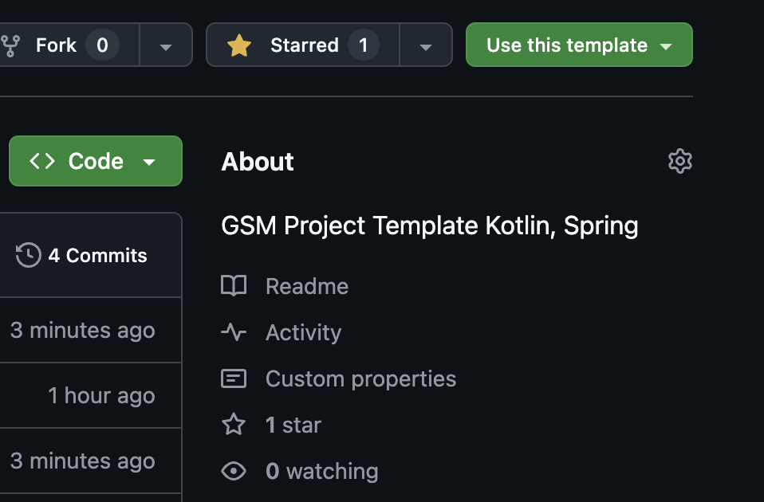

## GSM 프로젝트 Template Spring Kotlin 입니다.

### Provide
```
- spring boot, kotlin
- http, spring error handler
- security, jwt auth
- gsm student user table
```

### 사용 방법
repository 상단에 **use template**를 통해서 사용할 수 있습니다.

> 튜토리얼 image와 README 부분은 프로젝트 세팅 완료시 삭제해주세요.



아래와 같이 패키지들이 구성되어 있습니다.


- domain
    - auth
    - user
- global
    - config
    - error
    - filter
    - security
    - util

### 패키지 설명

user, auth에는 학생 데이터 템플릿과 RefreshToken 관련 로직이 존재합니다.

error, filter에는 error 핸들러와 JWT 인증, 필터단 예외 핸들링 필터가 존재합니다.

security에는 기본적인 시큐리티 설정과 핸들러, JWT 관련 클래스가 존재합니다.

config, util에는 redis 설정 클래스, properties scan 클래스가 존재합니다.

### 참고사항

spring security UserDetailsService를 구현하기 위해 임시로 user의 repository를 생성해두었습니다. 만약 user의 id값을 다른 형태로 변경한다면 그에 맞게 repository를 커스텀 해주세요.

JWT는 `Bearer ` prefix를 붙히고 있으며, accessToken은  `Authorization` 헤더에 담에 요청하는 것으로 구현되어 있습니다. 필요시 커스텀해서 사용해주세요.

예외를 throw하는 방법은 GlobalException을 throw하시면서 에러메세지와 HttpStatus 값을 사용해 생성하셔서 throw하시면 됩니다.

현재 인증되어있는 user의 정보를 얻고 싶다면 util.UserUtil 클래스의 getCurrentUser 메서드 호출로 user 객체를 반환 받을 수 있습니다.

### yml

```yml
spring:
  mvc:
    throw-exception-if-no-handler-found: true
  web:
    resources:
      add-mappings: false
  jpa:
    database-platform: org.hibernate.dialect.MySQL5InnoDBDialect
    show-sql: true
    hibernate:
      ddl-auto: ${DDL_AUTO}
    properties:
      hibernate:
        default_batch_fetch_size: 1000
        dialect: org.hibernate.dialect.MySQLDialect
    
  datasource:
    url: jdbc:mysql://${DB_URL}/${DB_NAME}?useSSL=false&characterEncoding=UTF-8&serverTimezone=Asia/Seoul&allowPublicKeyRetrieval=true
    username: ${DB_USER}
    password: ${DB_PASSWORD}
    driver-class-name: com.mysql.cj.jdbc.Driver
    
  data:
    redis:
      host: ${REDIS_HOST}
      port: ${REDIS_PORT}
    
  sql:
    init:
      mode: always

jwt:
  accessSecret: ${ACCESS_SECRET}
  refreshSecret: ${REFRESH_SECRET}
  accessExp: ${ACCESS_EXP}
  refreshExp: ${REFRESH_EXP}
```

위와 같이 설정이 되어있습니다. `${}` 으로 감싸져있는 환경변수 이름을 확인하시고 알맞는 값을 넣어주세요

### Docker

Dockerfile이 작성되어있습니다. 만약 다른 방식으로 배포를 진행하게 된다면 과감하게 삭제해주세요

### .github

Pull Request Template과 Issue Template가 존재합니다.

이슈 템플릿은 todo, bug로 구분되어 있으며, 필요시 변경 가능합니다.
